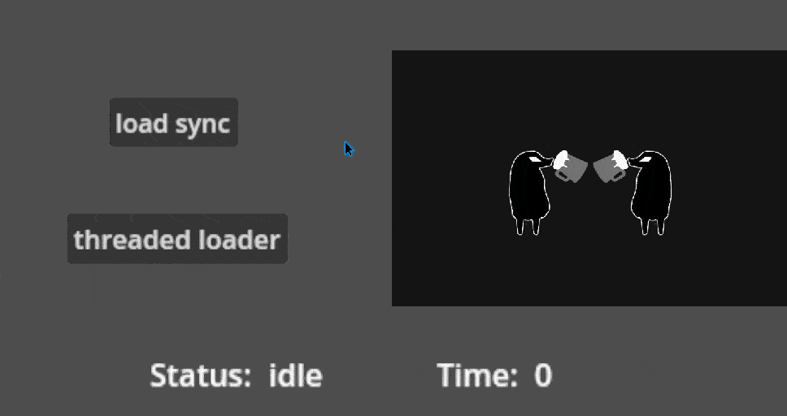

<p align="center">
  
</p>

<h1 align="center">
  Godot ThreadedResourceSaveLoad Plugin
</h1>

<p align="center">
  <a href="https://ko-fi.com/I2I31KH5HB" target="_blank">
	
  </a>
</p>

<h2 align="center">
  <a href="#file-saving"> File saving </a>
  |
  <a href="#file-loading"> File loading </a>
</h2>

<p align="center">
  
</p>


## See my other plugins

- [Projectile on curve 2D](https://github.com/MeroVinggen/Godot-ProjectileOnCurve2DPlugin)
- [Android Internet Connection State](https://github.com/MeroVinggen/Godot-AndroidInternetConnectionStatePlugin)
- [
Vector2 editor](https://github.com/MeroVinggen/Godot-Vector2ArrayEditorPlugin)
- [Awaiter](https://github.com/MeroVinggen/Godot-AwaiterPlugin)


## About

This plugin allows you to save/load resources <b>fast</b> in the background using threads, preventing the main thread freezes and handle the save/load operations using signals.


## Features

- adjusting threads amount to use per task
- progress/errors/start/complete signals 
- optional files access verification after save
- batching for resources saving 
- easy resources access on multiple resource load
- loading by groups
- loading by resource pass or UID path
  

## Requirements 

- Godot 4.1 or higher


## Installation

- Open the `AssetLib` tab in Godot with your project open
- Search for `ThreadedResourceSaveLoad` plugin and install the plugin by Mero
- Open Project -> Project Settings -> Plugins Tab and enable the plugin `ThreadedResourceSaveLoad`
- Done!


## Usage

> [!WARNING]
> Make sure to check [Caution](#Caution) section


## File saving

### Usage examples

```gdscript
# listen to needed signals 
ThreadedSaver.saveFinished.connect(_on_saved)

# add resources to be saved and call start
ThreadedSaver.add([
  [<resource1>, <save_path1>],
  [<resource2>, <save_path2>],
  ...
]).start()
```


### Methods

**`add`** - adding items to save queue. The params per file are same as for godot's `ResourceSaver`:

```gdscript
ThreadedSaver.add([
  [
    resource: Resource, 
    path: String | StringName = resource.resource_path,
    flags: BitField[SaverFlags] = 0
  ]
]) -> ThreadedResourceSaver
```

**`start`** - launch saving sequence for added items via `add` method

```gdscript
ThreadedSaver.start(
  verifyFilesAccess: bool = false, 
  threadsAmount: int = OS.get_processor_count() - 1
) -> ThreadedResourceSaver
```

*`verifyFilesAccess`* - ensures to emit `saveFinished` signal after saved files become accessible, useful when you need to change them right after saving but takes more time to process (depending on users system).

*`threadsAmount`* - how many threads will be used to process saving. You may pass your amount to save resources for additional parallel tasks (the amount will be cut to resources amount).

**`get_current_threads_amount`** - returns currently used threads amount

**`is_idle`** - returns bool state of ThreadedSaver


### Signals

`saveStarted(totalResources: int)` - is emitted after method `start` been called

`saveProgress(completedCount: int, totalResources: int, savedPath: String)` - is emitted per saved file (doesn't include access verification! see "Constructor params" section)

`saveFinished(savedPaths: Array[String])` - is emitted when all files been saved (including access verification)

`saveError(path: String, errorCode: Error)` - is emitted per saving err

`becameIdle()` - is emitted when all the jobs are finished and prev threads and data are cleared (see [General](#General) section for more details)


## File loading

### Usage example

#### Base loading
   
> [!TIP]  
> - `STRING_NAME` type is also supported
> - the key - is a name to access the loaded resource (if you path an empty string - the resource path will be used as a key)
> - see full params list at [Item params](#Item-params-1)

```gdscript
# listen to needed signals 
ThreadedLoader.loadFinished.connect(_on_loaded)

# add resources to be loaded and call start
ThreadedLoader.add([
  [<resource_key1>, <load_path>],
  [<resource_key2>, <load_path>],
  ...
]).start()
```


#### Group loading

> [!TIP]  
> - you can add more resources to the group at runtime by calling `add_group`
> - you can have unlimited amount of groups at the same time

```gdscript
# listen to needed signals 
ThreadedLoader.loadGroup.connect(_on_loaded)

# add resources to be loaded in group and call start
ThreadedLoader.add_group("group1", [
  [<resource_key1>, <load_path>],
  [<resource_key2>, <load_path>],
], true).start()
```


#### Accessing loaded resources

`ThreadedLoader` provides you with all the loaded resources cll as `Dictionary[key: resource]` in `loadFinished` signal

```gdscript
func start_load() -> void:
  ThreadedLoader.loadFinished.connect(_on_load_completed, CONNECT_ONE_SHOT)
  ThreadedLoader.add([
    ["img", [res://1.jpg],
    ["scene", [res://2.tscn],
  ])

func _on_load_completed(loadedFiles: Dictionary) -> void:
  loadedFiles.img   # accessing loaded resource from "res://1.jpg"
  loadedFiles.scene # accessing loaded resource from "res://2.tscn"
```

or you may iterate the `loadedFiles` dictionary in loop. 

Also you can get each loaded resource by listening the `loadProgress` signal or a certain group resources by `loadGroup` signal.

> [!TIP]  
> - see all the signals at [ThreadedLoader Signals](#loader-signals)


### Methods

**`add`** - adding items to load queue. The params per file are same as for godot's `ResourceLoader`:

```gdscript
ThreadedLoader.add([
  [
    key: String | StringName,
    path: String | StringName, 
    type_hint: String = "", 
    cache_mode: CacheMode = 1
  ]
]) -> ThreadedResourceLoader
```

**`add_group`** - adding items to load queue under a group key. The params for resources are same as in `add` method

```gdscript
ThreadedLoader.add_group(
  group_name: String, 
  resources: Array[Array], 
  ignore_in_finished: bool = false # if true - resources from this group will not be added to loaded resources for `loadFinished` signal
) -> ThreadedResourceLoader
```

**`start`** - launch loading sequence for added items  via `add` and `add_group` methods

```gdscript
ThreadedLoader.start(
  threadsAmount: int = OS.get_processor_count() - 1
) -> ThreadedResourceLoader
```

*`threadsAmount`* - how many threads will be used to process loading. You may pass your amount to save resources for additional parallel tasks (the amount will be cut to resources amount).

**`get_current_threads_amount`** - returns currently used threads amount

**`is_idle`** - returns bool state of ThreadedLoader


### Signals <a id="loader-signals"></a>

`loadStarted(totalResources: int)` - is emitted after method `start` been called

`loadProgress(completedCount: int, totalResources: int, resource: Resource, resource_key: String)` - is emitted per loaded file

`loadFinished(loadedFiles: Dictionary)` - is emitted when all files been loaded

`loadGroup(groupName: String, loaded: Dictionary, failed: Dictionary)` - is emitted when all resources in a group been loaded

`loadError(path: String)` - is emitted per loading err

`becameIdle()` - is emitted when all the job is finished and prev threads and data are cleared (see [General](#General) section for more details)


## General

1. You can globally silence all the warnings as shown below:

```gdscript
ThreadedSaver.ignoreWarnings = true
ThreadedLoader.ignoreWarnings = true
```

2. `ThreadedSaver` batches the passed resources to save, so if you simultaneously call saving for the same path - only the last one (newest) will be processed. This will gain you a bit of performance, depending on saving frequency and file sizes by cutting the redundant work.

3. The `threadsAmount` param for `start` method in both `ThreadedSaver` and `ThreadedLoader` will automatically shrink to processed resources amount and won't change till reaches idle state. It never automatically grows.

```gdscript
ThreadedLoader.add([
  ["shuriken", "res://shuriken.jpg"],
  ["board", "res://board.jpg"],
]).start(5) # will be cut to 2 threads

...

ThreadedLoader.add([
  ["shuriken", "res://shuriken.jpg"],
  ["board", "res://board.jpg"],
]).start(1) # will be used 1 thread
```


### Caution

1. Batch `start` calls for save / load operations with `add` method instead of saving / loading each file separately (less `start` calls = performance)

```gdscript
# ---- bad

ThreadedLoader.add([["shuriken", "res://shuriken.jpg"]]).start()
...
await ThreadedLoader.loadFinished
ThreadedLoader.add([["board", "res://board.jpg"]]).start()
...

# ---- good

ThreadedLoader.add([["shuriken", "res://shuriken.jpg"]])
...
ThreadedLoader.add([["board", "res://board.jpg"]])
 
ThreadedLoader.start()
```

2. Prefer explicit signal connections instead of `await` to avoid possible issues with godot. If you will use ThreadedLoader with `await` to load file that makes the same inside - the inner `await` will never resolve:

```gdscript
# ---- file: main.gd


func _loadSubResource() -> void:
  await ThreadedLoader.add[["cll", "cll.gd"]].start().loadFinished


# ---- file: cll.gd


var cll: Array[Resource] = [
  # never resolve!
  await ThreadedLoader.add[["t1", "texture1.png"]].start().loadFinished,
  await ThreadedLoader.add[["t2", "texture2.png"]].start().loadFinished,
  ...
]

```

All you need to do in this case - use for either outer or inner loaders (or both) explicit connection to the signal instead of `await`.

3. By default both `ThreadedLoader` and `ThreadedSaver` uses `OS.get_processor_count() - 1` amount of threads if you don't pass `threadsAmount` param, leaving 1 thread free. This is done on purpose to protect your main thread from freezes, but if your project won't do any hard work while you process resource save / load (like just showing the loading screen) - you may use all the threads and make this operations a bit faster, like in code example below. But it's not recommended as default behavior and better do some tests to confirm it behave as needed.

```gdscript
# using all the threads amount for resource load
ThreadedLoader.start(OS.get_processor_count())
```

4. Don't use "small deploy with network file system" for remote deploy, it will randomly cause resource loading errs. If you willing so or have to use it - to avoid the errs you will need to re-launch the project (maybe few time in a row).
  
5. The `start` params are ignored if been called when save / load was already in progress and the initial params will be used:

```gdscript
# start saving without `verifyFilesAccess`
ThreadedSaver.add([
  [res1, path1],
  [res2, path2],
  [res3, path3],
]).start(false, 3)

# start saving with `verifyFilesAccess`
ThreadedSaver.add([
  [res4, path4],
]).start(true) # if prev save is in progress at this point - this param will be ignored and file access for res4 won't be verified

```

If you need the new `start` params to be used - check saver / loader is idle via `is_idle` method and wait till it finish all current work, with the `becameIdle` signal. 
