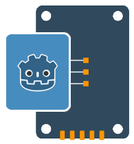

<p align="center">
  
</p>

<h1 align="center">
  Godot ThreadedResourceSaveLoad Plugin
</h1>

<p align="center">
  <a href="https://ko-fi.com/I2I31KH5HB" target="_blank">
	
  </a>
</p>

<h2 align="center">
  <a href="#file-saving"> File saving </a>
  |
  <a href="#file-loading"> File loading </a>
</h2>

<p align="center">
  
</p>


## About

This plugin allows you to save/load resources <b>fast</b> in the background using threads, preventing the main thread freezes and handle the save/load operations using signals.

> [!IMPORTANT]
> This is not the final solution for save/load processing in your project, but a wrapper for the native ResourceSaver and ResourceLoader, allowing them to be used in parallel. You may use it directly or build your save/load managers(modules) around it to suit your needs.


## Features

- Adjusting threads amount to use per task
- progress (files amount)/errors/start/complete signals 
- optional files access verification after save
  

## Requirements 

- Godot 4.1 or higher


## Installation

- Open the `AssetLib` tab in Godot with your project open
- Search for `ThreadedResourceSaveLoad` plugin and install the plugin by Mero
- Open Project -> Project Settings -> Plugins Tab and enable the plugin `ThreadedResourceSaveLoad`
- Done!


## Usage

> [!WARNING]
> Make sure to check [Caution](#Caution) section


## File saving

### How to use

1. add data to be saved via `add` method on plugin's singleton, each file params is passing as array in format: [Resource, String]

> [!TIP]
> See full params list at [Item params](#Item-params)

```gdscript
ThreadedSaver.add([
  [<your resource>, <your path to save>],
  [<your resource>, <your path to save>],
  ...
])
```

2. listen to needed signals

```gdscript
ThreadedSaver.saveCompleted.connect(_on_save_completed, CONNECT_ONE_SHOT)
```

3. start saving by calling `start` method
		
```gdscript
ThreadedSaver.start()
```

Also you may use inline saving and chain methods call:

> [!WARNING]
> Usage with `await` is undesirable, see [Caution](#Caution) section

```gdscript
await ThreadedSaver.add([
  [<your resource>, <your path to save>],
  [<your resource>, <your path to save>],
  ...
]).start().saveCompleted

# or

ThreadedSaver.add([
  [<your resource>, <your path to save>],
  [<your resource>, <your path to save>],
  ...
]).start().saveCompleted.connect(_on_save_completed, CONNECT_ONE_SHOT)

```


### Item params

The full params list per file is same as for godot's `ResourceSaver`:

```gdscript
[
  resource: Resource, 
  path: String = resource.resource_path,
  flags: BitField[SaverFlags] = 0
]
```


### Signals

```gdscript
# is emitted after method `start` been called
signal saveStarted(totalResources: int)

# is emitted per saved file (doesn't include access verification! see "Constructor params" section)
signal saveProgress(completedCount: int, totalResources: int)

# is emitted when all files been saved (including access verification)
signal saveCompleted(savedPaths: Array[String])

# is emitted per saving err
signal saveError(path: String, errorCode: Error)

# is emitted when ready for the next saving call (goes after `saveCompleted` signal)
signal saveReady()
```


### `start` method params


```gdscript
ThreadedSaver.start(
  verifyFilesAccess: bool = false, 
  threadsAmount: int = OS.get_processor_count() - 1
)
```

`verifyFilesAccess` - ensures to emit `saveCompleted` signal after saved files become accessible, useful when you need to change them right after saving but takes more time to process (depending on users system).

`threadsAmount` - how many threads will be used to process saving. You may pass your amount to save resources for additional parallel tasks (the amount will be cut to resources amount).


## File loading

### How to use`

1. add paths to be loaded and keys for them via `add` method on plugin's singleton, each file params is passing as array in format: Array[String, String]
   
> [!TIP]  
> - `STRING_NAME` type is also supported
> -  the key is string name to access the loaded resource (if you path empty string - the resource path will be used as key)
> - See full params list at [Item params](#Item-params-1)

```gdscript
ThreadedLoader.add([
  [<your key for resource>, <your path to load>],
  [<your key for resource>, <your path to load>],
  ...
])
```

1. listen to needed signals
   
```gdscript
ThreadedLoader.loadCompleted.connect(_on_load_completed, CONNECT_ONE_SHOT)
```

3. start loading by calling `start` method 	
   
```gdscript
ThreadedLoader.start()
```

Also you may use inline loading and chain methods call:

> [!WARNING]
> Usage with `await` is undesirable, see [Caution](#Caution) section

```gdscript
await ThreadedLoader.add([
  [<your key for resource>, <your path to load>],
  [<your key for resource>, <your path to load>],
  ...
]).start().loadCompleted

# or

ThreadedLoader.add([
  [<your key for resource>, <your path to load>],
  [<your key for resource>, <your path to load>],
  ...
]).start().loadCompleted.connect(_on_load_completed, CONNECT_ONE_SHOT)

```


### Item params

The full params list per file is same as for godot's `ResourceLoader`:

```gdscript
[
  key: String | StringName,
  path: String | StringName, 
  type_hint: String = "", 
  cache_mode: CacheMode = 1
]
```


### Signals

```gdscript
# is emitted after method `start` been called
signal loadStarted(totalResources: int)

# is emitted per loaded file
signal loadProgress(completedCount: int, totalResources: int, resource: Resource, resource_key: String)

# is emitted when all files been loaded
signal loadCompleted(loadedFiles: Dictionary)

# is emitted per loading err
signal loadError(path: String)

# is emitted when ready for the next loading call (goes after `loadCompleted` signal)
signal loadReady()
```


### `start` method params

```gdscript
ThreadedLoader.start(
  threadsAmount: int = OS.get_processor_count() - 1
)
```
`threadsAmount` - how many threads will be used to process loading. You may pass your amount to save resources for additional parallel tasks (the amount will be cut to resources amount)..


### Accessing loaded resources

`ThreadedLoader` provides you with `resource` itself and its `key` and `Dictionary[key: resource]` in `loadCompleted`

```gdscript
func start_load() -> void:
  ThreadedLoader.loadCompleted.connect(_on_load_completed, CONNECT_ONE_SHOT)
  ThreadedLoader.add([
    ["img", [res://1.jpg],
    ["scene", [res://2.tscn],
  ])

func _on_load_completed(loadedFiles: Dictionary) -> void:
  loadedFiles.img   # accessing loaded "res://1.jpg"
  loadedFiles.scene # accessing loaded "res://2.tscn"
```

or you may iterate the `loadedFiles` dictionary in loop. 

### Global config

You can globally silence all warnings as shown below:

```gdscript
ThreadedSaver.ignoreWarnings = true
ThreadedLoader.ignoreWarnings = true
```


### Caution

1. To gain more performance batch save / load calls with `add` method instead of saving / loading each file separately (less `start` calls == performance)

```gdscript
# ---- bad

ThreadedLoader.add([["shuriken", "res://shuriken.jpg"]]).start()
...
await ThreadedLoader.loadReady
ThreadedLoader.add([["board", "res://board.jpg"]]).start()
...

# ---- good

ThreadedLoader.add([
  ["shuriken", "res://shuriken.jpg"],
  ["board", "res://board.jpg"],
]).start()
...

```

2. Prefer explicit signal connections instead of `await` to avoid possible issues with godot (more info in #4)

3. After each finished saving / loading session (the `saveCompleted` / `loadCompleted` signals) singletons won't be available for next `start` call until they emit the `saveReady` / `loadReady` signal
 
4. If you will use ThreadedLoader with `await` to load file that makes the same inside - the inner `await` will never resolve:

```gdscript
# ---- file: main.gd


func _loadSubResource() -> void:
  await ThreadedLoader.add[["cll", "cll.gd"]].start().loadCompleted


# ---- file: cll.gd


var cll: Array[Resource] = [
  # never resolve!
  await ThreadedLoader.add[["t1", "texture1.png"]].start().loadCompleted,
  await ThreadedLoader.add[["t2", "texture2.png"]].start().loadCompleted,
  ...
]

```

All you need to do in this case - use for either outer or inner loaders (or both) explicit connection to the signal instead of `await`.

5. By default both `ThreadedLoader` and `ThreadedSaver` uses `OS.get_processor_count() - 1` amount of threads if you don't pass `threadsAmount` param, leaving 1 thread free. This is done on purpose to protect your main thread from freezes, but if your project won't do any hard work while you process resource save / load (like just showing the loading screen) - you may use all the threads and make this operations a bit faster, like in code example below. But it's not recommended as default behavior and better do some tests to confirm it behave as needed.

```gdscript
# using all the threads amount for resource load
ThreadedLoader.start(OS.get_processor_count())
```

6. Don't use "small deploy with network file system" for remote deploy, it will randomly cause resource loading errs. If you willing so or have to use it - to avoid the errs you will need to re-launch the project (maybe few time in a row).


## See my other plugins

- [ProjectileOnCurve2D ](https://github.com/MeroVinggen/Godot-ProjectileOnCurve2DPlugin)
- [	
Vector2 editor ](https://github.com/MeroVinggen/Godot-Vector2ArrayEditorPlugin)
- [Android Internet Connection State](https://github.com/MeroVinggen/Godot-AndroidInternetConnectionStatePlugin)
